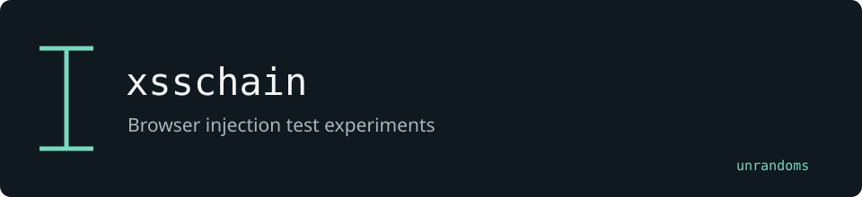

# xsschain

A BRS-XSS fork with additional browser-based test experiments and reporting integration.

Maintained by [unrandoms](https://github.com/unrandoms), derived from [easypro-tech/brs-xss](https://github.com/easypro-tech/brs-xss).

## Fork-specific work

- [`brsxss/detect/xss/stored/prober.py`](brsxss/detect/xss/stored/prober.py)
- [`cli/commands/simple_scan.py`](cli/commands/simple_scan.py)

## Validation and limits

Browser behavior requires validation in a controlled application. The external BRS-KB service belongs to the upstream ecosystem and is not maintained by this fork.

This documentation update does not certify all inherited features. The [archived reference](UPSTREAM_README.md) describes the original ecosystem; its package names and release links may target upstream rather than this fork.

## Credits

See [CREDITS.md](CREDITS.md) for the distinction between the original implementation and this fork's adaptations. Original licenses and copyright notices remain in the repository.
